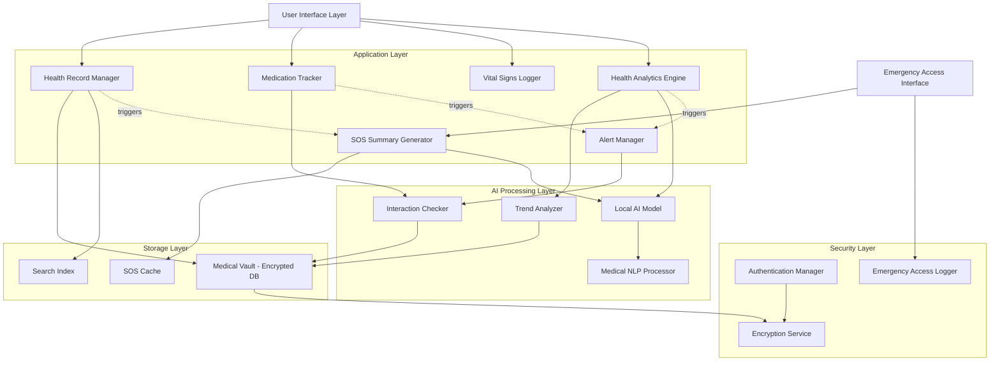

# Design Document: Personal Health AI Tracker (PHAIT)

## Overview

PHAIT is a privacy-first, on-device health data management system that combines secure local storage with AI-powered analysis to provide emergency medical information access, longitudinal health insights, and preventive health monitoring. The system architecture prioritizes data sovereignty, offline functionality, and instant emergency access while maintaining strong security boundaries.

The design follows a layered architecture with clear separation between:
- **Storage Layer**: Encrypted local database for health records
- **AI Processing Layer**: Local machine learning models for analysis & summarization
- **Application Layer**: Business logic for health tracking, alerts, & emergency access
- **Presentation Layer**: User interface & emergency responder views

Key design principles:
- **Zero external dependencies**: All data processing occurs on-device
- **Security by default**: Encryption at rest, configurable emergency access
- **Performance**: Sub-5-second SOS summary generation, sub-2-second search
- **Extensibility**: Pluggable AI models, flexible data import/export

## Architecture

### System Components



### Data Flow

**Normal Operation Flow:**
1. User authenticates through Authentication Manager
2. User adds/views health records through Health Record Manager
3. Records are encrypted and stored in Medical Vault
4. Search Index is updated for fast retrieval
5. SOS Summary Generator is triggered to update cached summary
6. Local AI Model processes records to generate summary
7. Health Analytics Engine periodically analyzes longitudinal data
8. Alert Manager monitors for preventive health concerns

**Emergency Access Flow:**
1. Emergency Responder accesses Emergency Access Interface
2. System checks emergency access configuration (PIN, biometric bypass, or open)
3. Emergency Access Logger records the access attempt
4. SOS Summary is retrieved from cache (no AI processing delay)
5. Summary is displayed in selected language
6. Access is restricted to SOS Summary only (no full record access)

## Components and Interfaces

### Medical Vault (Storage Layer)

The Medical Vault is an encrypted SQLite database that stores all health records locally.

**Schema Design:**

```
HealthRecord {
  id: UUID
  type: RecordType (prescription, lab_result, diagnosis, vaccination, clinical_note, document)
  title: String
  content: Text
  timestamp: DateTime
  created_at: DateTime
  updated_at: DateTime
  attachments: [Attachment]
  tags: [String]
  metadata: JSON
}

Attachment {
  id: UUID
  record_id: UUID
  file_path: String (encrypted file location)
  file_type: String (pdf, jpg, png, txt)
  file_size: Integer
  checksum: String
}

Medication {
  id: UUID
  name: String
  dosage: String
  frequency: String
  start_date: Date
  end_date: Date?
  active: Boolean
  reminders: [Reminder]
  interactions: [String]
}

Reminder {
  id: UUID
  medication_id: UUID
  time: Time
  days_of_week: [Integer]
  enabled: Boolean
}

VitalSign {
  id: UUID
  type: VitalType (blood_pressure, heart_rate, temperature, weight, glucose, oxygen_saturation)
  value: Float
  unit: String
  timestamp: DateTime
  notes: String?
}

SOSCache {
  id: UUID
  language: String
  content: Text
  generated_at: DateTime
  record_hash: String (hash of all records used to detect staleness)
}

EmergencyAccessLog {
  id: UUID
  timestamp: DateTime
  access_method: String (pin, biometric_bypass, open)
  success: Boolean
}

UserConfig {
  id: UUID
  emergency_access_mode: String (pin_protected, biometric_bypass, always_accessible)
  emergency_pin: String? (hashed)
  preferred_languages: [String]
  alert_preferences: JSON
  normal_ranges: JSON (for vital signs)
}
```

**Interface:**

```
interface MedicalVault {
  // Health Records
  addRecord(record: HealthRecord): Result<UUID>
  getRecord(id: UUID): Result<HealthRecord>
  updateRecord(id: UUID, record: HealthRecord): Result<void>
  deleteRecord(id: UUID): Result<void>
  searchRecords(query: SearchQuery): Result<[HealthRecord]>
  listRecords(filter: RecordFilter, sort: SortOrder): Result<[HealthRecord]>
  
  // Medications
  addMedication(med: Medication): Result<UUID>
  getMedication(id: UUID): Result<Medication>
  updateMedication(id: UUID, med: Medication): Result<void>
  deleteMedication(id: UUID): Result<void>
  listActiveMedications(): Result<[Medication]>
  
  // Vital Signs
  logVitalSign(vital: VitalSign): Result<UUID>
  getVitalSigns(type: VitalType, timeRange: TimeRange): Result<[VitalSign]>
  
  // SOS Cache
  getSOSCache(language: String): Result<SOSCache>
  updateSOSCache(language: String, content: Text, recordHash: String): Result<void>
  
  // Emergency Access
  logEmergencyAccess(log: EmergencyAccessLog): Result<void>
  getEmergencyAccessLogs(timeRange: TimeRange): Result<[EmergencyAccessLog]>
  
  // Configuration
  getConfig(): Result<UserConfig>
  updateConfig(config: UserConfig): Result<void>
  
  // Backup/Restore
  exportData(): Result<EncryptedArchive>
  importData(archive: EncryptedArchive): Result<ImportReport>
}
```

### Encryption Service (Security Layer)

Handles all encryption/decryption operations using AES-256-GCM for data at rest.

**Interface:**

```
interface EncryptionService {
  // Initialize with user's master key (derived from password/biometric)
  initialize(masterKey: Key): Result<void>
  
  // Encrypt/decrypt data
  encrypt(plaintext: Bytes): Result<EncryptedData>
  decrypt(encrypted: EncryptedData): Result<Bytes>
  
  // Key derivation
  deriveKey(password: String, salt: Bytes): Result<Key>
  
  // Secure deletion
  secureErase(filePath: String): Result<void>
}

struct EncryptedData {
  ciphertext: Bytes
  nonce: Bytes
  tag: Bytes
}
```

### Authentication Manager (Security Layer)

Manages user authentication and emergency access control.

**Interface:**

```
interface AuthenticationManager {
  // Normal authentication
  authenticate(credentials: Credentials): Result<Session>
  logout(session: Session): Result<void>
  isAuthenticated(session: Session): Boolean
  
  // Emergency access
  checkEmergencyAccess(attempt: EmergencyAccessAttempt): Result<EmergencySession>
  configureEmergencyAccess(mode: EmergencyAccessMode, pin: String?): Result<void>
  
  // Biometric
  registerBiometric(): Result<void>
  authenticateWithBiometric(): Result<Session>
}

enum EmergencyAccessMode {
  PinProtected,
  BiometricBypass,
  AlwaysAccessible
}

struct EmergencyAccessAttempt {
  method: String
  pin: String?
  biometricFailures: Integer?
}
```

### Local AI Model (AI Processing Layer)

Processes health records using a locally-hosted language model (e.g., quantized Llama, Mistral, or medical-specific model).

**Interface:**

```
interface LocalAIModel {
  // Initialize model (load weights into memory)
  initialize(modelPath: String): Result<void>
  
  // Generate SOS summary from health records
  generateSOSSummary(records: [HealthRecord], language: String): Result<String>
  
  // Analyze longitudinal data for trends
  analyzeTrends(records: [HealthRecord], vitalSigns: [VitalSign]): Result<[HealthInsight]>
  
  // Check medication interactions
  checkInteractions(medications: [Medication]): Result<[InteractionWarning]>
  
  // Translate medical text
  translate(text: String, targetLanguage: String): Result<String>
}

struct HealthInsight {
  type: InsightType (trend, pattern, anomaly)
  severity: Severity (info, warning, critical)
  title: String
  description: String
  relatedRecords: [UUID]
  confidence: Float
}

struct InteractionWarning {
  medications: [UUID]
  severity: Severity
  description: String
  recommendation: String
}
```

### SOS Summary Generator (Application Layer)

Orchestrates SOS summary generation and caching.

**Interface:**

```
interface SOSSummaryGenerator {
  // Generate and cache SOS summary
  generateSummary(forceRefresh: Boolean): Result<void>
  
  // Get cached summary for emergency access
  getSummary(language: String): Result<String>
  
  // Check if cache is stale
  isCacheStale(): Boolean
  
  // Get summary generation status
  getStatus(): GenerationStatus
}

struct GenerationStatus {
  isGenerating: Boolean
  lastGenerated: DateTime?
  languages: [String]
  recordCount: Integer
}
```

### Health Record Manager (Application Layer)

Manages CRUD operations for health records with search and organization.

**Interface:**

```
interface HealthRecordManager {
  // CRUD operations
  createRecord(record: HealthRecordInput): Result<UUID>
  getRecord(id: UUID): Result<HealthRecord>
  updateRecord(id: UUID, updates: HealthRecordUpdate): Result<void>
  deleteRecord(id: UUID): Result<void>
  
  // Search and filter
  search(query: String): Result<[HealthRecord]>
  filter(criteria: FilterCriteria): Result<[HealthRecord]>
  
  // Import/Export
  importRecords(files: [File]): Result<ImportReport>
  exportRecords(format: ExportFormat): Result<File>
  
  // Attachments
  addAttachment(recordId: UUID, file: File): Result<UUID>
  getAttachment(id: UUID): Result<File>
  deleteAttachment(id: UUID): Result<void>
}

struct HealthRecordInput {
  type: RecordType
  title: String
  content: Text
  timestamp: DateTime?
  tags: [String]
  metadata: JSON?
}

struct FilterCriteria {
  types: [RecordType]?
  dateRange: TimeRange?
  tags: [String]?
  searchText: String?
}

enum ExportFormat {
  EncryptedArchive,
  PDF,
  FHIR_JSON
}
```

### Alert Manager (Application Layer)

Monitors health data and generates preventive alerts.

**Interface:**

```
interface AlertManager {
  // Check for alerts based on current data
  checkAlerts(): Result<[Alert]>
  
  // Get active alerts
  getActiveAlerts(): Result<[Alert]>
  
  // Manage alerts
  acknowledgeAlert(id: UUID): Result<void>
  dismissAlert(id: UUID): Result<void>
  snoozeAlert(id: UUID, duration: Duration): Result<void>
  
  // Configure alert rules
  configureAlertRules(rules: [AlertRule]): Result<void>
}

struct Alert {
  id: UUID
  type: AlertType (medication_interaction, dietary_restriction, vital_sign_abnormal, trend_warning)
  severity: Severity
  title: String
  description: String
  recommendation: String
  relatedRecords: [UUID]
  createdAt: DateTime
  status: AlertStatus (active, acknowledged, dismissed, snoozed)
}

struct AlertRule {
  type: AlertType
  enabled: Boolean
  parameters: JSON
}
```

### Medication Tracker (Application Layer)

Manages medication schedules, reminders, and adherence tracking.

**Interface:**

```
interface MedicationTracker {
  // Medication management
  addMedication(med: MedicationInput): Result<UUID>
  updateMedication(id: UUID, updates: MedicationUpdate): Result<void>
  discontinueMedication(id: UUID, endDate: Date): Result<void>
  
  // Reminders
  setReminder(medId: UUID, reminder: ReminderInput): Result<UUID>
  updateReminder(id: UUID, reminder: ReminderInput): Result<void>
  deleteReminder(id: UUID): Result<void>
  
  // Adherence tracking
  recordDose(medId: UUID, timestamp: DateTime, taken: Boolean): Result<void>
  getAdherenceRate(medId: UUID, timeRange: TimeRange): Result<Float>
  
  // Interaction checking
  checkInteractions(): Result<[InteractionWarning]>
}

struct MedicationInput {
  name: String
  dosage: String
  frequency: String
  startDate: Date
  endDate: Date?
}

struct ReminderInput {
  time: Time
  daysOfWeek: [Integer]
  enabled: Boolean
}
```

### Vital Signs Logger (Application Layer)

Logs and tracks vital signs with trend visualization.

**Interface:**

```
interface VitalSignsLogger {
  // Log vital signs
  logVitalSign(vital: VitalSignInput): Result<UUID>
  
  // Retrieve vital signs
  getVitalSigns(type: VitalType, timeRange: TimeRange): Result<[VitalSign]>
  getTrends(type: VitalType, timeRange: TimeRange): Result<TrendData>
  
  // Normal ranges
  setNormalRange(type: VitalType, min: Float, max: Float): Result<void>
  getNormalRange(type: VitalType): Result<Range>
  
  // Device integration
  importFromDevice(deviceData: DeviceData): Result<ImportReport>
}

struct VitalSignInput {
  type: VitalType
  value: Float
  unit: String
  timestamp: DateTime?
  notes: String?
}

struct TrendData {
  dataPoints: [VitalSign]
  average: Float
  min: Float
  max: Float
  trend: TrendDirection (increasing, decreasing, stable)
}
```

## Data Models

### Core Data Types

```
enum RecordType {
  Prescription,
  LabResult,
  Diagnosis,
  Vaccination,
  ClinicalNote,
  Document
}

enum VitalType {
  BloodPressure,
  HeartRate,
  Temperature,
  Weight,
  BloodGlucose,
  OxygenSaturation
}

enum Severity {
  Info,
  Warning,
  Critical
}

enum AlertType {
  MedicationInteraction,
  DietaryRestriction,
  VitalSignAbnormal,
  TrendWarning
}

enum AlertStatus {
  Active,
  Acknowledged,
  Dismissed,
  Snoozed
}

enum TrendDirection {
  Increasing,
  Decreasing,
  Stable
}

struct TimeRange {
  start: DateTime
  end: DateTime
}

struct Range {
  min: Float
  max: Float
}

struct SearchQuery {
  text: String
  types: [RecordType]?
  dateRange: TimeRange?
  tags: [String]?
  limit: Integer?
}

struct ImportReport {
  totalRecords: Integer
  successfulImports: Integer
  failedImports: Integer
  errors: [ImportError]
}

struct ImportError {
  fileName: String
  reason: String
}
```

### SOS Summary Structure

The SOS Summary follows a standardized format for emergency responders:

```
struct SOSSummary {
  // Critical Information (always at top)
  allergies: [String]
  currentMedications: [MedicationSummary]
  chronicConditions: [String]
  bloodType: String?
  
  // Emergency Contacts
  emergencyContacts: [EmergencyContact]
  
  // Recent Medical History (last 6 months)
  recentDiagnoses: [String]
  recentProcedures: [String]
  recentHospitalizations: [String]
  
  // Additional Notes
  specialConsiderations: [String]
  
  // Metadata
  generatedAt: DateTime
  language: String
}

struct MedicationSummary {
  name: String
  dosage: String
  frequency: String
}

struct EmergencyContact {
  name: String
  relationship: String
  phone: String
}
```


## Correctness Properties

A property is a characteristic or behavior that should hold true across all valid executions of a system—essentially, a formal statement about what the system should do. Properties serve as the bridge between human-readable specifications and machine-verifiable correctness guarantees.

### Storage and Security Properties

**Property 1: Local-only storage**
*For any* health record operation (create, read, update, delete), all data SHALL be stored exclusively in local file system paths and no data SHALL be written to network locations or cloud storage paths.
**Validates: Requirements 1.1**

**Property 2: Encryption at rest**
*For any* health record stored in the Medical Vault, the on-disk representation SHALL be encrypted such that reading the raw database file produces non-plaintext data.
**Validates: Requirements 1.2**

**Property 3: Authentication required for normal access**
*For any* attempt to access the Medical Vault without valid authentication credentials, the system SHALL reject the access request and return an authentication error.
**Validates: Requirements 1.3**

**Property 4: Network isolation**
*For any* operation involving health records or AI processing, network traffic monitoring SHALL show zero transmission of health record data to external servers.
**Validates: Requirements 1.4, 4.4**

**Property 5: Secure deletion**
*For any* health record that is deleted, subsequent attempts to recover the data from disk (including forensic recovery tools) SHALL fail to retrieve the original plaintext data.
**Validates: Requirements 1.5**

### Emergency Access Properties

**Property 6: SOS summary generation performance**
*For any* set of health records, generating an SOS summary SHALL complete within 5 seconds, and regenerating after updates SHALL complete within 10 seconds.
**Validates: Requirements 2.2, 2.4**

**Property 7: SOS summary completeness**
*For any* generated SOS summary, the output SHALL contain all required fields: allergies, current medications, chronic conditions, emergency contacts, and blood type (if available).
**Validates: Requirements 2.3**

**Property 8: SOS summary format accessibility**
*For any* generated SOS summary, the output format SHALL be one of: plain text, HTML, or PDF, requiring no proprietary software to view.
**Validates: Requirements 2.5**

**Property 9: Emergency access logging**
*For any* emergency access attempt (successful or failed), an audit log entry SHALL be created with a timestamp and access method.
**Validates: Requirements 7.4**

**Property 10: Emergency access restriction**
*For any* emergency access session, only the SOS summary SHALL be accessible, and attempts to access full health records SHALL be denied.
**Validates: Requirements 7.5**

### Health Record Management Properties

**Property 11: Record storage with timestamp**
*For any* health record added to the system, retrieving the record SHALL return the original data along with a timestamp indicating when it was created.
**Validates: Requirements 3.1**

**Property 12: Multi-type record support**
*For any* record type in the set {Prescription, LabResult, Diagnosis, Vaccination, ClinicalNote, Document}, the system SHALL successfully store and retrieve records of that type.
**Validates: Requirements 3.2**

**Property 13: Search performance and accuracy**
*For any* search query, the system SHALL return results matching the search criteria within 2 seconds, and all returned results SHALL match the specified criteria.
**Validates: Requirements 3.3**

**Property 14: Attachment support**
*For any* health record, attaching files of types {PDF, JPEG, PNG} SHALL succeed, and subsequent retrieval SHALL return the original file with matching checksum.
**Validates: Requirements 3.4**

**Property 15: Chronological ordering**
*For any* set of health records displayed with default sorting, the records SHALL be ordered by timestamp in descending order (newest first).
**Validates: Requirements 3.5**

### Alert and Monitoring Properties

**Property 16: Alert list maintenance**
*For any* user with documented allergies or dietary restrictions, querying the active alert list SHALL return entries corresponding to those restrictions.
**Validates: Requirements 5.1**

**Property 17: Medication interaction checking**
*For any* new medication added when preventive monitoring is enabled, the system SHALL perform interaction analysis against existing medications before confirming the addition.
**Validates: Requirements 5.2, 9.4**

**Property 18: Alert generation on risk detection**
*For any* identified health risk (medication interaction, dietary violation, abnormal vital sign), a preventive alert SHALL be generated immediately.
**Validates: Requirements 5.3**

**Property 19: Alert structure completeness**
*For any* generated preventive alert, the alert SHALL contain: specific risk description, affected health record IDs, and recommended actions.
**Validates: Requirements 5.4**

**Property 20: Alert management actions**
*For any* active alert, the system SHALL support all three management actions: acknowledge, dismiss, and snooze, and performing any action SHALL update the alert status accordingly.
**Validates: Requirements 5.5**

**Property 21: Vital sign range alerting**
*For any* vital sign logged that falls outside the user-configured normal range for that vital type, a preventive alert SHALL be generated.
**Validates: Requirements 10.5**

### Offline Functionality Properties

**Property 22: Complete offline operation**
*For any* core system operation (record CRUD, AI analysis, SOS generation, search, alerts) performed with network connectivity disabled, the operation SHALL complete successfully with the same results as when online.
**Validates: Requirements 6.1, 6.2, 6.3**

**Property 23: Data integrity during state transitions**
*For any* data operation performed during network state transitions (online to offline or offline to online), the data SHALL remain consistent and no corruption SHALL occur.
**Validates: Requirements 6.5**

### Emergency Access Configuration Properties

**Property 24: Emergency access mode configuration**
*For any* emergency access mode in the set {PinProtected, BiometricBypass, AlwaysAccessible}, the system SHALL allow configuration of that mode and SHALL enforce the corresponding access rules.
**Validates: Requirements 7.1**

**Property 25: PIN-protected emergency access**
*For any* emergency access attempt when mode is set to PIN-protected, access to the SOS summary SHALL be granted if and only if the correct emergency PIN is provided.
**Validates: Requirements 7.2**

### Data Import and Export Properties

**Property 26: Multi-format import support**
*For any* file of type {PDF, JPEG, PNG, plain text}, the import operation SHALL successfully create a health record with the file as an attachment.
**Validates: Requirements 8.1**

**Property 27: Structured data parsing**
*For any* valid HL7 FHIR or CCD document, the import operation SHALL successfully parse the structured data and create corresponding health records with correct field mappings.
**Validates: Requirements 8.2**

**Property 28: Export performance**
*For any* export request, the system SHALL generate an encrypted archive of all health records within 30 seconds.
**Validates: Requirements 8.3**

**Property 29: Dual-format export**
*For any* export operation, the system SHALL provide both human-readable (PDF) and machine-readable (FHIR JSON) format options.
**Validates: Requirements 8.4**

**Property 30: Import-export round trip**
*For any* set of health records, exporting to an encrypted archive and then importing that archive into a fresh system SHALL produce an equivalent set of health records with matching content and metadata.
**Validates: Requirements 8.5**

### Medication Tracking Properties

**Property 31: Medication data completeness**
*For any* medication added to the system, retrieving the medication SHALL return all required fields: name, dosage, frequency, and start date.
**Validates: Requirements 9.1**

**Property 32: Reminder scheduling**
*For any* medication with a configured reminder at time T, the system SHALL trigger a notification at time T (within 1-minute tolerance).
**Validates: Requirements 9.2**

**Property 33: Reminder notification actions**
*For any* triggered medication reminder, the notification SHALL provide both "confirm" and "skip" actions, and selecting either SHALL record the adherence event.
**Validates: Requirements 9.3**

**Property 34: Adherence rate calculation**
*For any* medication with recorded dose events, the adherence rate SHALL equal (confirmed doses / total scheduled doses) over the specified time range.
**Validates: Requirements 9.5**

### Vital Signs Properties

**Property 35: Vital sign type support**
*For any* vital sign type in the set {BloodPressure, HeartRate, Temperature, Weight, BloodGlucose, OxygenSaturation}, the system SHALL successfully log and retrieve values of that type.
**Validates: Requirements 10.1**

**Property 36: Vital sign data structure**
*For any* vital sign logged, retrieving the vital sign SHALL return the value, unit, timestamp, and optional notes.
**Validates: Requirements 10.2**

### Multi-Language Properties

**Property 37: Multi-language SOS generation**
*For any* language in the set {English, Spanish, French, German, Mandarin}, the system SHALL successfully generate an SOS summary in that language.
**Validates: Requirements 11.1**

**Property 38: Proactive multi-language generation**
*For any* set of preferred languages configured by the user, the system SHALL pre-generate and cache SOS summaries in all specified languages.
**Validates: Requirements 11.2**

**Property 39: Multi-language cache invalidation**
*For any* health record update, all cached SOS summaries in all configured languages SHALL be regenerated within 10 seconds.
**Validates: Requirements 11.5**

### Backup and Recovery Properties

**Property 40: Backup creation**
*For any* backup operation, the system SHALL create an encrypted file containing all health records, medications, vital signs, and configuration data.
**Validates: Requirements 12.1**

**Property 41: Backup destination flexibility**
*For any* valid file system path (local disk, external drive, network mount), the system SHALL successfully save backup files to that location.
**Validates: Requirements 12.2**

**Property 42: Backup-restore round trip**
*For any* system state, creating a backup and then restoring that backup into a fresh system SHALL produce an equivalent system state with matching data and configuration.
**Validates: Requirements 12.3**

**Property 43: Backup integrity verification**
*For any* backup file, the system SHALL compute and store a cryptographic checksum, and verification SHALL confirm the file has not been modified.
**Validates: Requirements 12.4**

**Property 44: Corrupted backup rejection**
*For any* backup file with invalid checksum or decryption failure, the restore operation SHALL fail with a descriptive error and SHALL NOT import any partial data.
**Validates: Requirements 12.5**

## Error Handling

### Error Categories

The system defines the following error categories:

1. **Authentication Errors**: Invalid credentials, expired sessions, biometric failures
2. **Storage Errors**: Disk full, file system permissions, encryption/decryption failures
3. **Validation Errors**: Invalid data format, missing required fields, constraint violations
4. **Performance Errors**: Operation timeout, resource exhaustion
5. **Import/Export Errors**: Unsupported format, corrupted file, parsing failures
6. **Network Errors**: Connection failures (should not affect core functionality)

### Error Handling Principles

**Fail-safe defaults**: When errors occur, the system SHALL default to the most secure state (e.g., deny access rather than grant it).

**Error recovery**: For transient errors (disk temporarily full, temporary resource exhaustion), the system SHALL retry operations with exponential backoff.

**User notification**: All errors SHALL be presented to users in plain language with actionable guidance (e.g., "Disk space low. Please free up 500MB to continue.").

**Audit logging**: All security-relevant errors (authentication failures, encryption errors, emergency access attempts) SHALL be logged with timestamps.

**Graceful degradation**: If AI model loading fails, the system SHALL continue to function for record management, but SHALL disable AI-dependent features (insights, interaction checking) and notify the user.

### Specific Error Scenarios

**Encryption key loss**: If the master encryption key is lost (user forgets password and has no backup), data recovery is impossible by design. The system SHALL clearly warn users during initial setup about the importance of password backup.

**Corrupted database**: If the SQLite database becomes corrupted, the system SHALL attempt automatic recovery using SQLite's built-in recovery tools. If recovery fails, the system SHALL restore from the most recent backup if available.

**AI model errors**: If the local AI model produces invalid output or crashes, the system SHALL log the error, fall back to template-based SOS summaries, and notify the user to check for model updates.

**Import parsing errors**: When importing structured data (FHIR, CCD), if parsing fails for specific fields, the system SHALL import successfully parsed fields and report which fields failed, allowing partial import rather than complete failure.

**Reminder notification failures**: If the system cannot deliver a medication reminder (e.g., notification service unavailable), the system SHALL queue the reminder and deliver it when the service becomes available, marking it as delayed.

## Testing Strategy

### Dual Testing Approach

The testing strategy employs both unit testing and property-based testing as complementary approaches:

- **Unit tests**: Verify specific examples, edge cases, error conditions, and integration points between components
- **Property tests**: Verify universal properties across all inputs through randomized testing

Together, these approaches provide comprehensive coverage: unit tests catch concrete bugs in specific scenarios, while property tests verify general correctness across the input space.

### Property-Based Testing Configuration

**Library Selection**: Use a property-based testing library appropriate for the implementation language:
- Python: Hypothesis
- TypeScript/JavaScript: fast-check
- Java: jqwik
- Rust: proptest
- Go: gopter

**Test Configuration**:
- Each property test MUST run a minimum of 100 iterations (due to randomization)
- Each property test MUST reference its design document property using a comment tag
- Tag format: `// Feature: personal-health-ai-tracker, Property {number}: {property_text}`

**Property Test Implementation**:
- Each correctness property listed in this document MUST be implemented by a SINGLE property-based test
- Tests should generate random valid inputs (health records, medications, vital signs, etc.)
- Tests should verify the property holds for all generated inputs
- Tests should use shrinking to find minimal failing examples when properties are violated

### Unit Testing Focus

Unit tests should focus on:
- **Specific examples**: Concrete scenarios that demonstrate correct behavior (e.g., "adding a prescription record with specific fields")
- **Edge cases**: Boundary conditions (empty databases, maximum field lengths, special characters)
- **Error conditions**: Invalid inputs, authentication failures, corrupted data
- **Integration points**: Component interactions (e.g., SOS generator calling AI model, alert manager triggering notifications)

Avoid writing too many unit tests for scenarios that property tests already cover. For example, if a property test verifies "for any health record, storage and retrieval preserves data," you don't need unit tests for every record type—focus unit tests on edge cases like maximum field lengths or special characters.

### Test Organization

```
tests/
├── unit/
│   ├── storage/
│   │   ├── medical_vault_test
│   │   ├── encryption_service_test
│   │   └── search_index_test
│   ├── security/
│   │   ├── authentication_test
│   │   └── emergency_access_test
│   ├── application/
│   │   ├── health_record_manager_test
│   │   ├── medication_tracker_test
│   │   └── alert_manager_test
│   └── ai/
│       ├── local_ai_model_test
│       └── sos_generator_test
├── property/
│   ├── storage_properties_test
│   ├── security_properties_test
│   ├── emergency_access_properties_test
│   ├── record_management_properties_test
│   ├── alert_properties_test
│   ├── offline_properties_test
│   ├── import_export_properties_test
│   ├── medication_properties_test
│   ├── vital_signs_properties_test
│   ├── multilanguage_properties_test
│   └── backup_properties_test
└── integration/
    ├── end_to_end_workflows_test
    └── performance_test
```

### Test Data Generation

For property-based tests, generators should produce:
- **Valid health records**: Random record types, timestamps, content, attachments
- **Valid medications**: Random names, dosages, frequencies, schedules
- **Valid vital signs**: Random types, values within physiologically plausible ranges
- **Valid user configurations**: Random emergency access modes, language preferences, alert settings
- **Edge cases**: Empty strings, maximum lengths, special characters, boundary values

### Performance Testing

Performance requirements with specific time bounds (e.g., "within 5 seconds", "within 2 seconds") should be verified through:
- Property tests that measure execution time for random inputs
- Performance regression tests that track timing trends over commits
- Load tests that verify performance under stress (large databases, many concurrent operations)

### Security Testing

Security properties should be verified through:
- Property tests for encryption (verify on-disk data is not plaintext)
- Property tests for authentication (verify unauthenticated access fails)
- Network monitoring tests (verify no data transmission)
- Penetration testing for emergency access modes
- Fuzzing for input validation and parsing

### Integration Testing

Integration tests should verify:
- End-to-end workflows (add record → generate SOS → emergency access)
- Component interactions (AI model → SOS generator → cache)
- Import/export round trips with real file formats
- Backup/restore round trips with real databases
- Multi-language generation with real AI models

### Continuous Testing

All tests should run:
- On every commit (unit tests, fast property tests)
- On pull requests (full test suite including integration tests)
- Nightly (extended property tests with 1000+ iterations, performance tests)
- Before releases (full test suite, manual security review, penetration testing)
